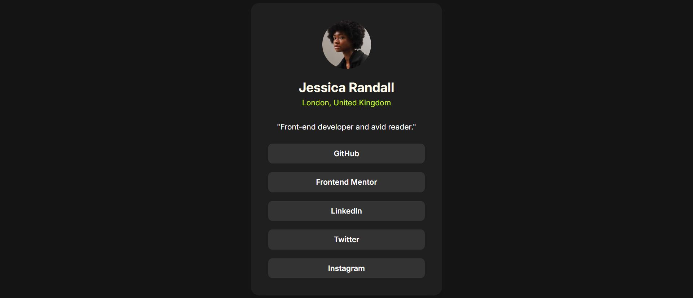

# Frontend Mentor - Social links profile solution

This is a solution to the [Social links profile challenge on Frontend Mentor](https://www.frontendmentor.io/challenges/social-links-profile-UG32l9m6dQ). Frontend Mentor challenges help you improve your coding skills by building realistic projects. 

## Overview

### Welcome! 👋
Thanks for checking out my solution to the Social Links Profile challenge from Frontend Mentor.
This project focuses on building a responsive and accessible user profile card that displays social media links using clean HTML and Tailwind CSS.

### The challenge
Users should be able to:

- View the optimal layout for the interface depending on their device’s screen size.
- See hover and focus states for all interactive elements.
- Navigate easily with proper semantic HTML and accessibility in place.

### Screenshot

### Links

- Solution URL: [repository URL](https://github.com/saramx-dev/Social-links-profile)
- Live Site URL: [live URL](https://saramx-dev.github.io/Social-links-profile/)

## My process

### Built with

- Semantic HTML5 markup
- Tailwind CSS for utility-first styling
- CSS custom properties for consistent theme colors
- Flexbox and CSS Grid for layout structure
- Mobile-first workflow
- Accessible markup with ARIA roles and labels

### What I learned
- Build accessible navigation using <nav> and aria-label for better screen reader support.
- Implement custom HSL color variables and apply them in utility classes.

### Continued development
In future projects, I want to:

Explore accessible component patterns such as keyboard navigation and focus management.

Use Tailwind plugins (like typography or forms) for more advanced styling.

Experiment with dark/light mode toggles and global themes using CSS variables.

### Useful resources
- Tailwind CSS docs
- and other online resources

## Author
- Frontend Mentor - [@saramx-dev](https://www.frontendmentor.io/profile/saramx-dev)  
- Twitter - [@saramx_dev](https://x.com/saramx_dev)  
- LinkedIn - [Sara Mohamed](https://www.linkedin.com/in/saramx-dev/)  

---

## Acknowledgments
Thanks to the Frontend Mentor team and community for providing these hands-on challenges that make front-end practice both practical and enjoyable.

